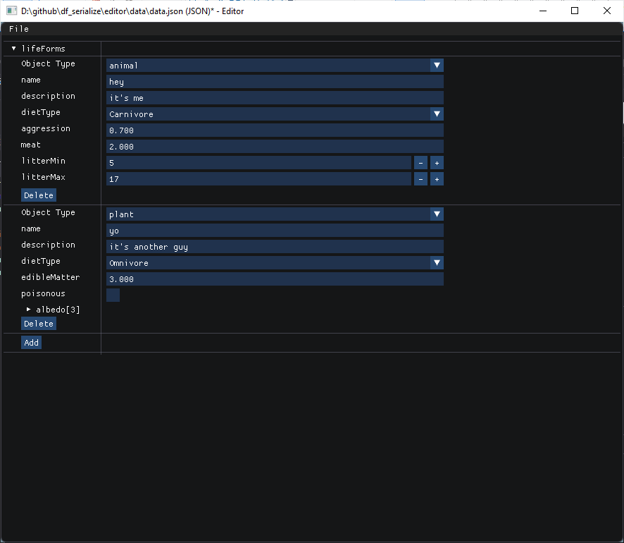
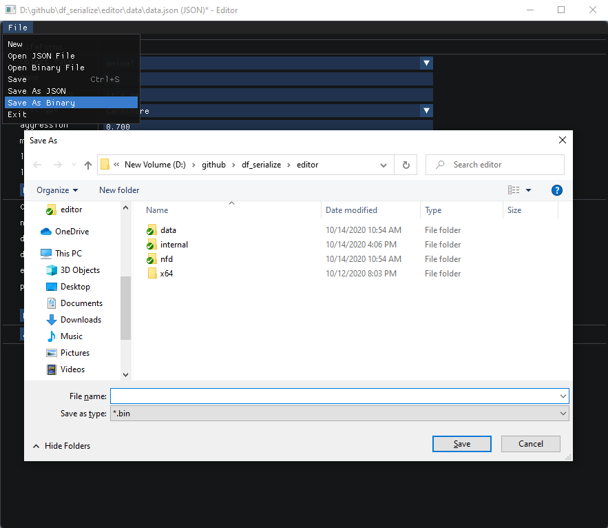

# df_serialize

## Folders

1. **df_serialize** - this is the library itself and is all you need.  If you want to serialize json you will also want the rapidjson folder.
2. **editor** - an editor which can save/load json files of the schema type, and can also save binary files or "cook" json files to binary via the command line.
3. **imgui** - imgui submodule, used by the editor.
4. **rapidjson** - used by the editor and the test app both to serialize json.
4. **test** - this is a test program which also serves as an example for how to use the library.

## Using The Demofox Serialization Library

Minimal header only C++ library that allows you to define data schemas which then can be read or written in JSON or binary.  Nested structures, arrays, struct inheritance and nullable variants are supported.  By default, STL container types are used, but that can be configured in Config.h. STL is not a requirement.

the df_serialize folder is the minimum of what you need, but if you are planning on doing json reading and writing, you will also want the rapidjson folder.

The test project shows how to use the library.

Schemas are defined in header files using C++ macros, like the below.

```c++
STRUCT_BEGIN(Lifeforms, Plant, "A plant based life form")
    STRUCT_FIELD(std::string, name, "", "The name of the plant.")
    STRUCT_FIELD(std::string, description, "", "A description of the plant.")
    STRUCT_FIELD(float, edibleMatter, 1.0f, "The number of kilograms of edible matter on the plant.")
    STRUCT_FIELD(bool, poisonous, false, "Whether the plant is poisonous")
STRUCT_END()
```

You define schemas in header files.  Multiple schemas can exist per header file, and you can have multiple header files with schemas in them.

Those schemas are then expanded into definitions of types and serialization code by including specific header files from this library.

If the schema above was the contents of a "schemas.h" file, you could make a file "types.h" and put the below in it.

```c++
// Include this header to include the types defined by the schemas
#pragma once
#include "df_serialize/MakeTypes.h"
#include "schemas.h"
```

"MakeTypes.h" will turn the schemas into the types they define, as if the types were written out manually in this file. That means you can include
the above "types.h" file in any .h or .cpp that wants those types defined.

Other df_serialize headers do other tasks.  See the "Expanding Schemas" section below for more information.

After expanding your schemas, you can use the types as if you wrote them out by hand.

```c++
Lifeforms::Plant plant;
plant.name = "Hector";
plant.description = "Despite his sedentary nature, Hector is not one to be trifled with";
plant.edibleMatter = 9001.0f;
plant.poisonous = true;
```

Serialization is done via simple function calls like the below.  You can read/write json/binary with files on disk and buffers in memory.

```c++
// Read JSON file
Lifeforms::Plant plant;
if (!ReadFromJSONFile(plant, "plant.json"))
{
    printf("Could not read plant.json!!\n");
    return false;
}

// Write JSON file
Lifeforms::Plant plant;
if (!WriteToJSONFile(plant, "plant.json"))
{
    printf("Could not write plant.json!!\n");
    return false;
}

// Read binary file
Lifeforms::Plant plant;
if (!ReadFromBinaryFile(plant, "plant.dat"))
{
    printf("Could not read plant.dat!!\n");
    return false;
}

// Write binary file
Lifeforms::Plant plant;
if (!WriteToBinaryFile(plant, "plant.dat"))
{
    printf("Could not write plant.dat!!\n");
    return false;
}
```

## Schema Definitions

The "Description" field in all the macros below are useful for reflection to documentation, or tooltips in
editors and similar.  Normal serialization operations ignore them.

**`STRUCT_BEGIN(NameSpace, Name, Description)`**

This makes a struct named "Name" in the namespace "Namespace".
The example at the top of this file makes a struct named LifeForms::Plant.

**`STRUCT_INHERIT_BEGIN(NameSpace, Name, Base, Description)`**

Same as STRUCT_BEGIN but makes the struct derive from Base class.  If the base class is not a type defined
in this schema system, it will complain about not knowing how to serialize the base type and give a compile
error saying "Unsupported type encountered".  If you make a serialization function for that type, even if it
does nothing, that will satisfy the compiler.  That function doesn't have to be inside of df_serialize code,
it just has to be defined before df_serialize headers are included.

**`STRUCT_FIELD(Type, Name, Default, Description)`**

This adds a field to the struct of type "Type" with the name "Name" and a default value of "Default".
The first field in the example names a "std::string name" in the struct.
Note that the type can be either other schema defined types (they need to be defined above this schema) or
they can be types defined outside the schema: your own structs or PODs like ints and floats.

**`STRUCT_FIELD_NO_SERIALIZE(Type, Name, Default, Description)`**

The same as STRUCT_FIELD but this field doesn't serialize in or out. This is useful for transient storage
needed at runtime.

**`STRUCT_DYNAMIC_ARRAY(Type, Name, Description)`**

This defines a field as a dynamic sized array of another type.
Note that the type can be either other schema defined types (they need to be defined above this schema) or
they can be types defined outside the schema: your own structs or PODs like ints and floats.
When using arrays in schemas, they use a templated type TDYNAMICARRAY for the dynamic array.
By default it defines this as std::vector, but you can change that in Config.h

**`STRUCT_STATIC_ARRAY(Type, Name, Size, Default, Description)`**

This defines a field as a static sized array of another type, and wants a default value.

**`STRUCT_END()`**

This specifies the end of the schema definition.

**`ENUM_BEGIN(Namespace, Name, Description)`**

Defines an enum named "Name" in the namespace "Namespace"

**`ENUM_ITEM(Name, Description)`**

Defines an enum value

**`ENUM_END()`**

The end of an enum definition

**`VARIANT_BEGIN(NameSpace, Name, Description)`**

This declares a new variant type.  Variant types are tagged unions and can be one of a list of types described as
possibe for that variant. It can also be none of them, which can be thought of as variants being nullable.

If you are looking to keep a list of unknown size of objects, optionally sharing a base class, a dynamic array of a
variant type will get you that. The test project shows how to do that.

**`VARIANT_TYPE(Type, Name, Default, Description)`**

This declares an allowed type for a variant, and the name of the storage for that type, as well as the default value
for that type.

**`VARIANT_END()`**

This ends the declaration of a variant.

## Expanding Schemas

The header files beginning with underscores are for internal use only. The header files without underscores are meant
to be used by users of the library, as needed.

**`Config.h`**

This allows you to configure how df_serialize works, by letting you specify a log function, a dynamic array type,
a static array type, and a dynamic string type.

If you need to have different configurations for different schemas, setting these defines before doing the schema expansion
will over-ride whatever the settings in this file say.

**`MakeTypes.h`**

This expands the schemas into the types defined. You include this file before the schemas.

**`MakeHTMLHeader.h` & `MakeHTMLFooter.h`**

These make a function `bool WriteHTML(const char* fileName)` which writes the details of all schemas to an HTML
file. This shows how you could generate documentation or reflect schemas for things other than serialization.
The Header.h should be included before the schemas and Footer.h should be included after the schemas.

**`MakeJSONReadHeader.h` & `MakeJSONReadFooter.h` & `MakeJSONWriteHeader.h` & `MakeJSONWriteFooter.h`**

These expands the schemas into `ReadFromJSON*` and `WriteToJSON*` functions.
The basic built in type serialization functions (like ints, strings, etc) are found at the bottom of the `Header.h`
file.  You can add more basic types by following the patterns there, either in that file, or in your own files.
The `Header.h` should be included before the schemas and `Footer.h` should be included after the schemas.

JSON Reading

All fields are optional.  Unrecognized fields are ignored. Enum values are read as strings. Variant types are
read based on the name of their storage.

JSON Writing

Only fields that are not default value are written out. Enum values are written as strings. Variant types are
written based on the name of their storage.

**`MakeEqualityTest.h`**

This makes `==` and `!=` operators for all the types.  JSON writing uses this to skip writing default valued objects.

**`MakeBinaryReadHeader.h` & `MakeBinaryReadFooter.h` & `MakeBinaryWriteHeader.h` & `MakeBinaryWriteFooter.h`**

This expands the schemas into `ReadFromBinary*` and `WriteToBinary*` functions.
The basic built in type serialization functions (like ints, strings, etc) are found at the bottom of the `Header.h`
file.  You can add more basic types by following the patterns there, either in that file, or in your own files.
The `Header.h` should be included before the schemas and `Footer.h` should be included after the schemas.

Binary Reading

A single `fread()` is done to get the binary file into memory, then each value is pulled out from that memory
buffer individually, and recursively.  Enum values are read as null terminated strings. `std::string` is
read as null terminated strings. Variants have their "type index" written out followed by the data of that type
if the type is not null.

Binary Writing

A memory buffer is built up by visiting all data items recursively, and having each basic type grow a `std::vector`
and put their binary representation into the buffer.  When this is done, that binary buffer is written to disk
in a single `fwrite()`. Enum values are written as null terminated strings. `std::string` is written as null
terminated strings. Variants write their "type index" and then the data for that type index if the type is not null.
All fields are written.

## The Editor

The editor lives in the "editor" folder, within the root folder of this repo.  After cloning the repo you must init and update the submodules to get imgui, before editor will build in visual studio:

```
git submodule init
git submodule update
```

You must modify the editor's config.h file to include your schemas instead of the test schemas, and also to specify which type is the root document.

After that, the editor will compile and run, allowing you to load/save json/binary files.

The editor also has command line options to load up one file and save it as another, which is useful for "cooking" json files to binary.

Run the editor with the first argument being the file to load, and the second argument being the file to save as.

It is assumed that json files will end in .json, and binary files will end in .bin, but either argument can be a binary or json file.




